#Supabase

Это справочник по безсерверной базе данных "**Supabase**"

##Содержание:
1. [Регистрация](#Регистрация)
2. [Создание проекта](#Создание_проекта)

##Регистрация
<a name="Регистрация"></a>

Для того что бы начать пользоваться Supabse необходимо зарегестрироваться на [сайте](https://app.supabase.com/)

>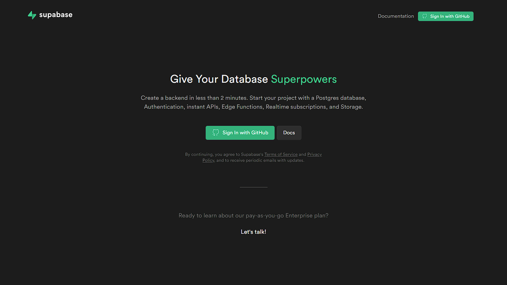
>Здесь вы должны нажать на кнопку "**Sing In with GitHub**"
---
>Скорее всего у вас должно появиться такое:
>
>Или такое окно:
>
>Если у вас нет такого окна, то зарегестрируйтесь на [GitHub](https://github.com/)
>Потом нажимаете на "**Authorize supabase**"

##Создание проекта
<a name="Создание_проекта"></a>

>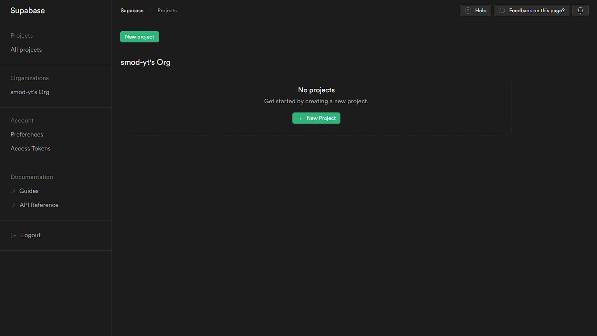
>После того как вы зарегестрировались, у вас появится такое окно
>Вы должны нажать на кнопку "**New Project**"
---
>У вас появится такое окно
>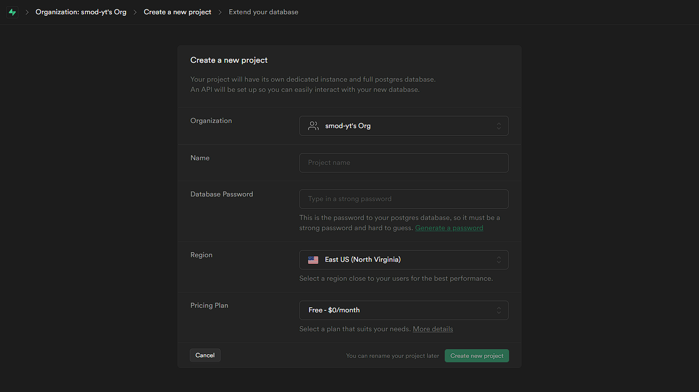
>Тут вы должны указать название вашего проекта и **надёжный** пароль для базы данных
>
>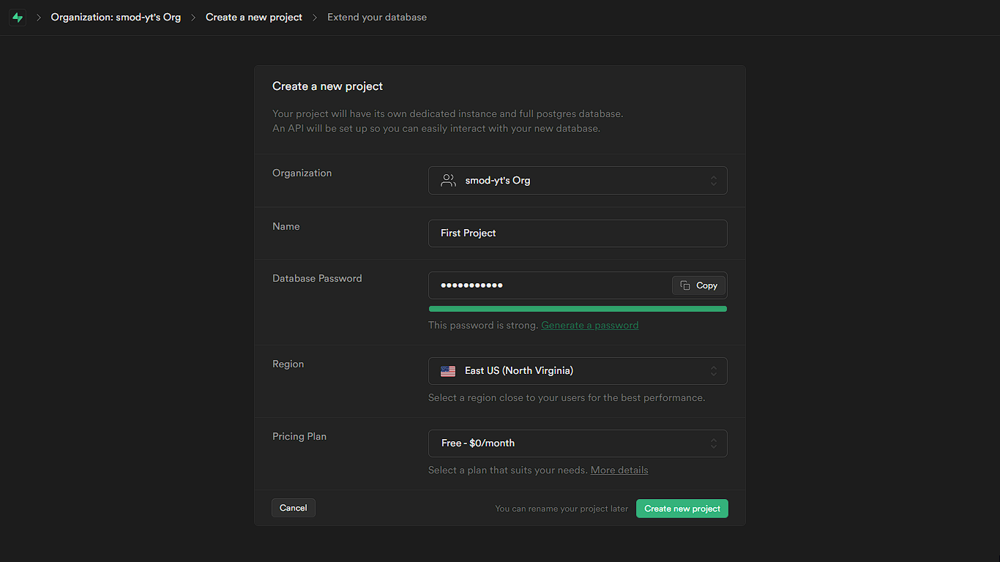
>После этого нажимаете на кнопку "**Create new project**"

##Создане базы данных

>После создания проекта у вас должно появиться такое
>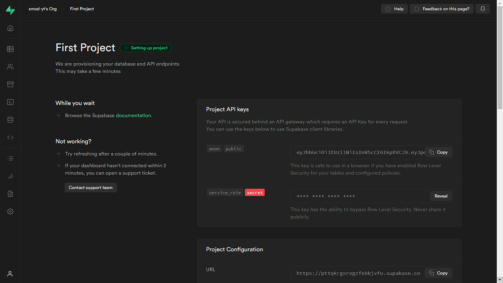
>или такое окно
>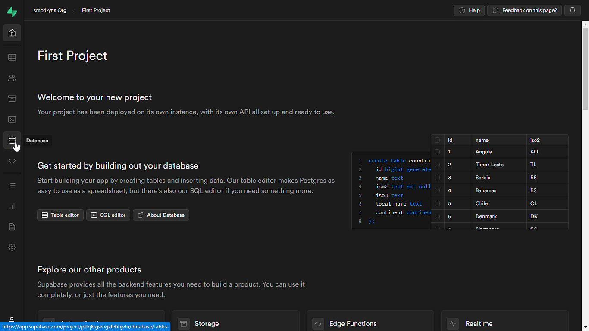
>Вы должны нажать на кнопку "**Databases**"

>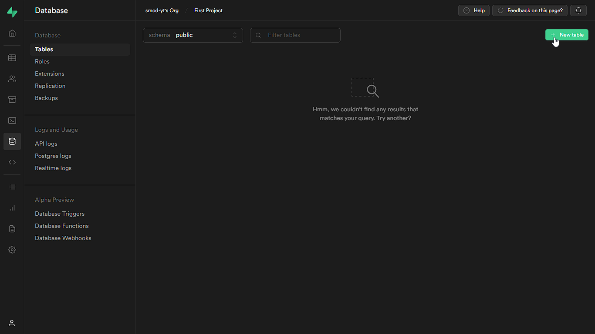
>Вы появитесь в таком окне. Вы должны нажать на "**New table**"

>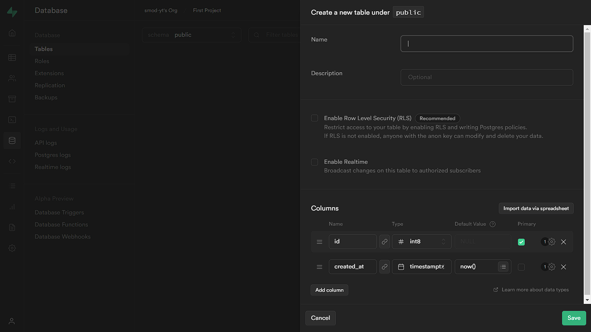
>У вас появится окно создания таблицы
>Тут вы должны указать:
>
> * Название
> * Описание (Необязательно)
> * Значения таблицы:
> * * Name: Имя значения
> * * Type: Тип значения:
> * * * int[2/4/8]: Числовое значение (Чем больше цифра, то есть 2/4/8, тем больше это значение будет занимать памяти)
> * * * float[4/8]: Число с плавающей запятой (десятичное, сотое, тысячное и т.д. Чем больше цифра, то есть 4/8, тем больше это значение будет занимать памяти)
> * * * numeric: Точное целое число
> * * * json: Текстовые данные JSON
> * * * jsonb: Двоичные данные JSON, декомпозированные
> * * * text: Текстовое значение
> * * * varchar: Текстовое значение, в конце которого игнорируются пробелы
> * * * UUID: Универсальный уникальный идентификатор
> * * * date: Дата (год, месяц, день)
> * * * time: Время суток (без часового пояса)
> * * * timez: Время суток (включая часовой пояс)
> * * * timestamp: Дата и время (без часового пояса)
> * * * timestampz: Дата и время (включая часовой пояс)
> * * * bool: Логическое значение, True(Да) или False(Нет)
> * * Default Value: Значение по умолчанию (Например если кто-то не указал значение)
> * * **Primary**: Главное значение
>
>Одно из значений должно быть главным, то есть должна стоять галочка "**Primary**"
>
>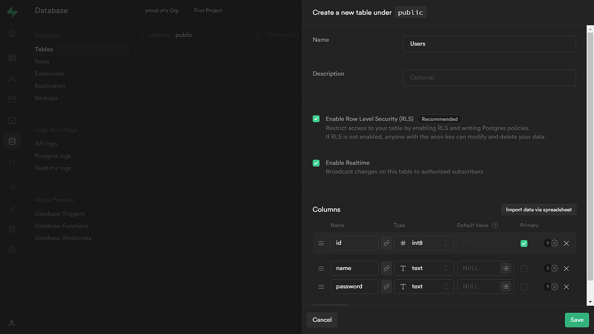
>
>Если у вас (как и у меня) главным значением является "**id**", которое всегда должно быть уникальным (то есть не повторяющимся), то вам нужно поставить галочку "**Is Unique**"
>
>Можете так же поставить галочку "**Enable Realtime**" что бы изменения отображались в реальном времени
>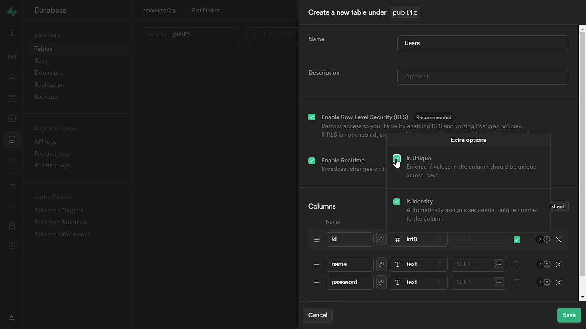
>После этого нажимаете на кнопку "**Save**"

>После того как вы нажали на "**Save**", у вас появится таблица:
>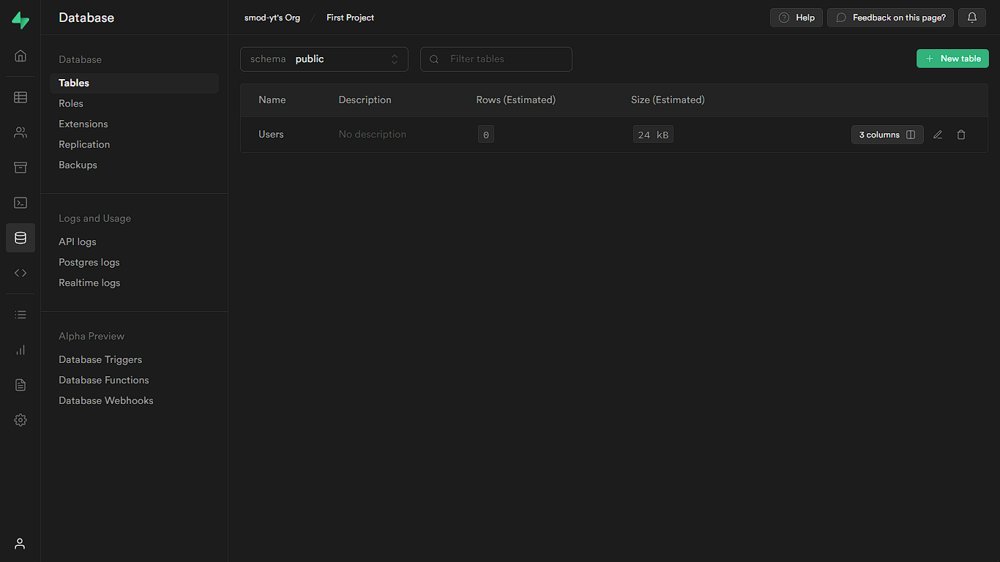

>Что бы управлять таблицей, нужно зайти в панель управления этой таблицы
>
>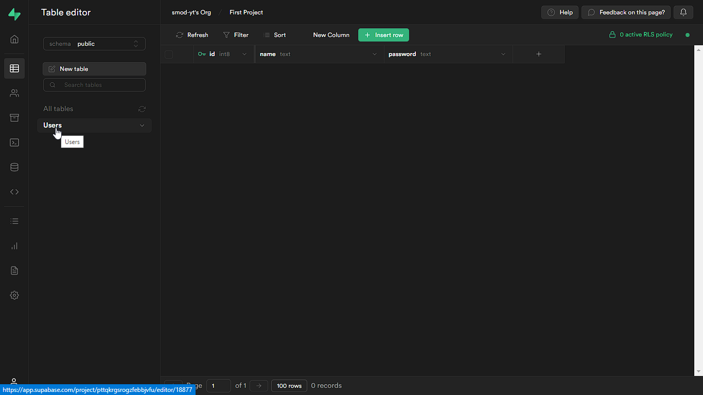
>Для этого нажмите на "**Table Editor**", а затем на свою таблицу
>
>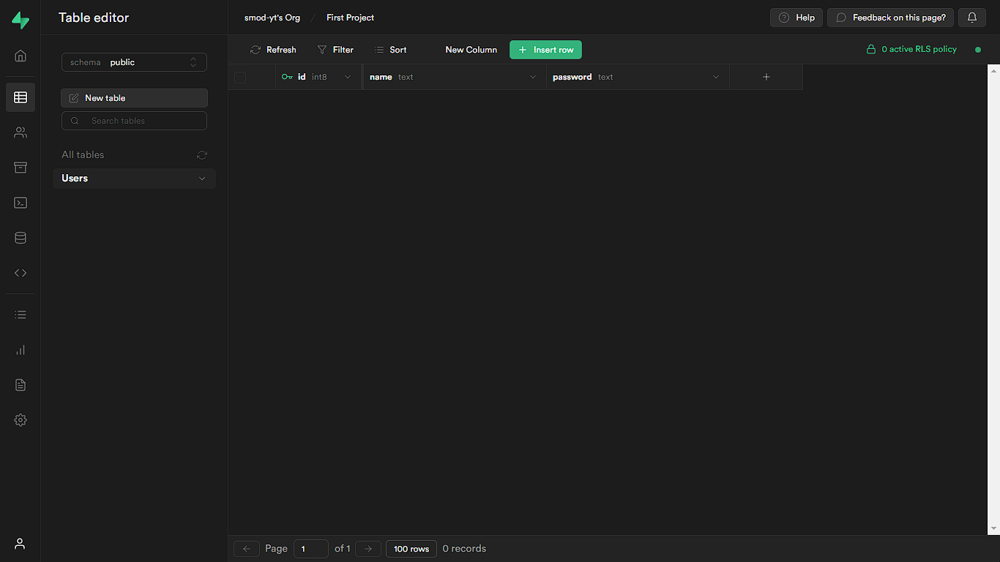
>У вас появится такое окно. Тут можно добавлять, изменять и удалять значения этой таблицы

##Добавляем Supabase на сайт

>Для того, что бы добавить "**Supabase**" на ваш сайт, надо в нужном HTML файле добавить скрипт Supabase:
>```html
><script src="https://cdn.jsdelivr.net/npm/@supabase/supabase-js"></script>
>```
>И так же добавить скрипт в котором вы будете работать:
>```html
><script src="script.js"></script>
>```
>
>По итогу ваш пустой HTML файл должен выглядеть вот так:
>```html
><!DOCTYPE html>
><html lang="en">
><head>
>    <meta charset="UTF-8">
>    <meta http-equiv="X-UA-Compatible" content="IE=edge">
>    <meta name="viewport" content="width=device-width, initial-scale=1.0">
>    <title>Template</title>
></head>
><body>
>    <script src="https://cdn.jsdelivr.net/npm/@supabase/supabase-js"></script>
>    <script src="script.js"></script>
></body>
></html>
>```

##Подключаемся к базе данных

>Для того что бы подключиться к вашей базе данных, вам нужно добавить в ваш js файл следующие строки кода:
>```js
>const url = 'url'
>const key = 'key'
>```